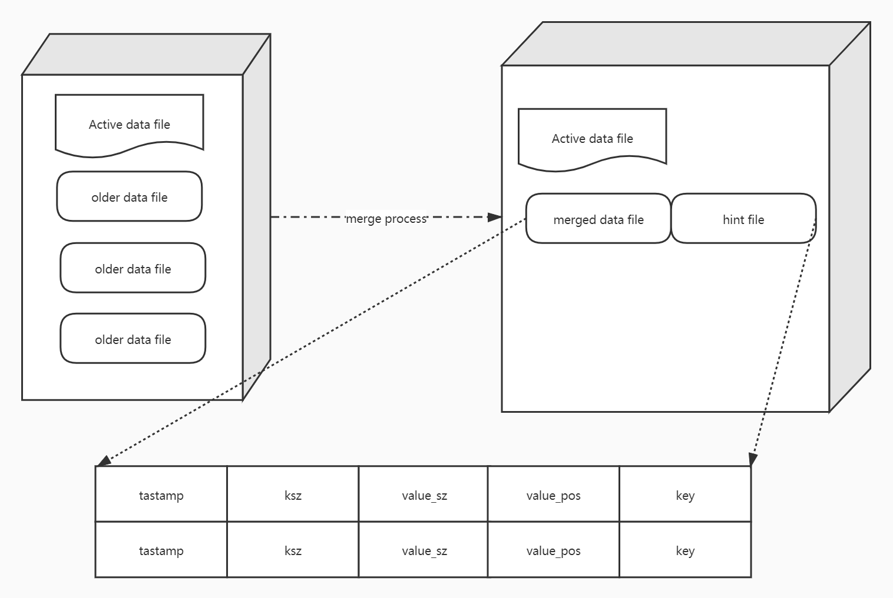

# bitcask
erlang bitcask golang implementation,
Suitable for storing large amounts of small files



## Use
`go get github.com/dollarkillerx/bitcask`

```go
cask, err := bitcask.New(dir, nil)  // Crc32 check is enabled by default
	if err != nil {
		log.Fatalln(err)
	}
defer cask.Close()

err = cask.set([]byte("file.name"), []byte("file boyd"))

r, err := cask.get([]byte("file.name"))

cask.del([]byte("file.name"))
```

## 设计模型以及特点
- 所有 `key` 存储与内存中, 所有 `key` 都存储于磁盘中
- 有序写: `Append` 方式写入, 减少磁盘寻道时间, 
- 更新数据: 把新数据追加到文件最后, 然后更新数据文件指针映射
- 读数据: 通过数据指针 + 偏移量, 时间复杂度 `O(1)`
- `bitcask`有一个合并时间窗口, 当旧数据占到一定比例时, 触发合并操作, 同时为了简单, 会把旧数据重新追加到可写入文件中

### 存储原理
- 磁盘源数据域 `data`
> `bitcask` 的数据文件分为只读文件和唯一一个读写文件

| crc | tstamp | ksz | value_sz| key | value |
| :-----| ----: | ----: | ----: | ----: | :----: |
| crc | tstamp | ksz | value_sz| key | value |

- 内存源数据域 `hint`
> 为了加快索引的重建速度，每个数据文件对应一个 `hint` 文件

| Key ->  | file_id | value_sz | value_pos| tstamp | 
| :-----| ----: | ----: | ----: | :----: |
| Key ->  | file_id | value_sz | value_pos| tstamp | 

### Hint File
> 用于重建 `HashMap` 数据结构以及 `HashMap` 持久化


### 详细设计见 `INFO.md`